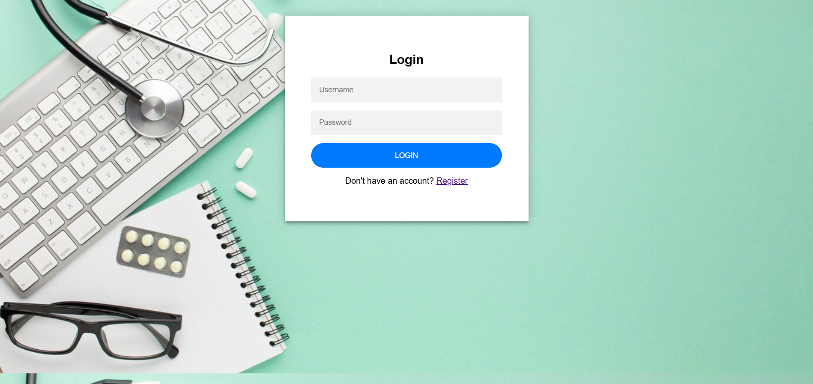
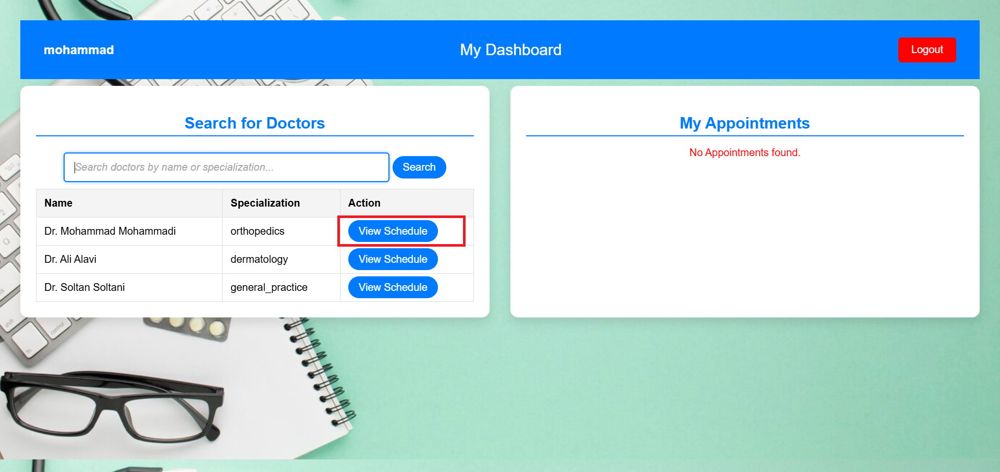
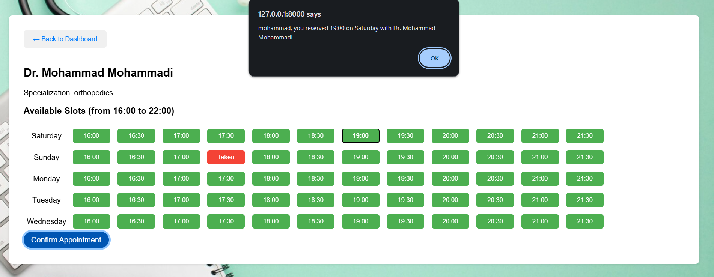
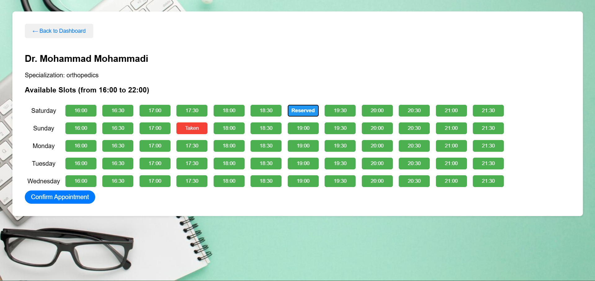
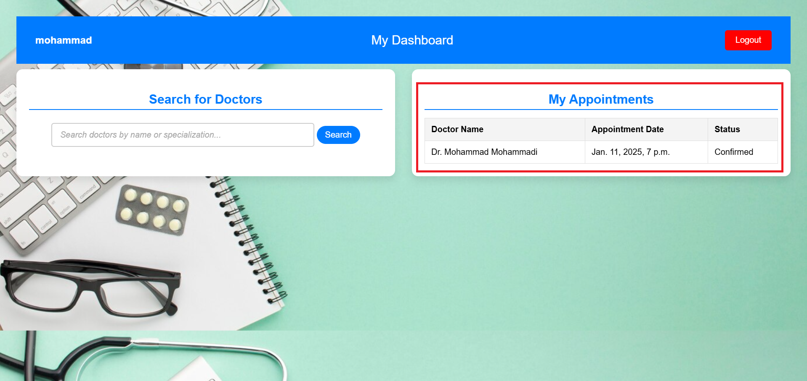
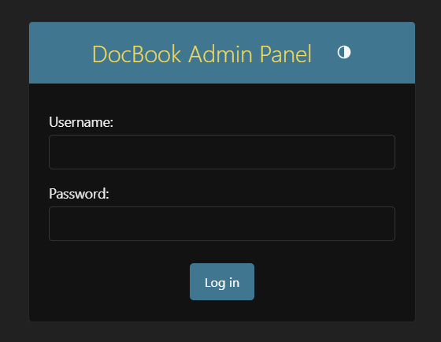
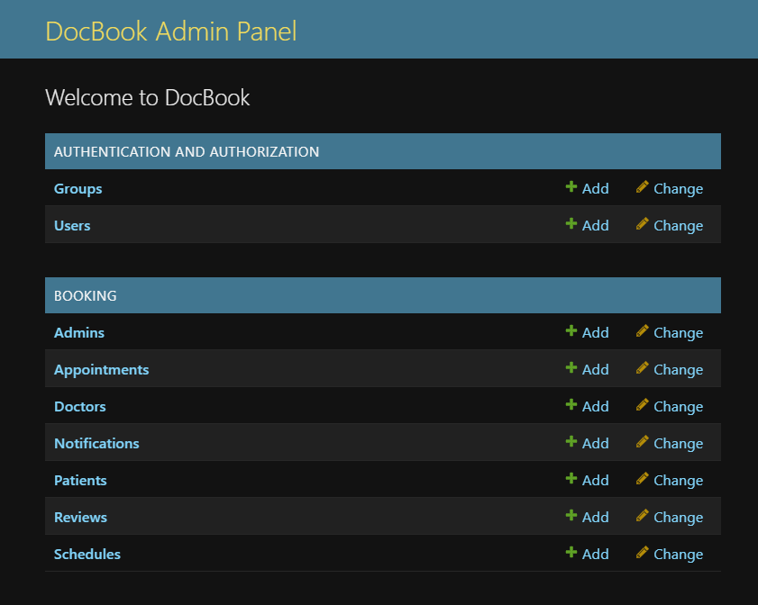

---
# DocBook - Doctor Appointment Booking System

## Overview
DocBook is a Django-based web application that allows patients to book appointments with doctors. It provides an intuitive platform for managing doctor schedules and patient bookings, offering seamless workflows for both parties.

## Features
- **User Authentication**: Patients can log in and manage their appointments.
- **Search Doctors**: Dynamic search functionality to find doctors by name or specialization.
- **View Doctor Schedules**: Patients can view available time slots and select a convenient one.
- **Appointment Management**: Patients can book, view, and confirm their appointments.
- **REST API**: Integrated API endpoints for searching doctors and managing data.

## Main Workflows

### Patient Workflow
1. **Login/Registration**:
   - Users can sign in or register using the registration form.
   - Registered users can manage appointments via the dashboard.
     

2. **Search Doctors**:
   - Search by name or specialization using the search bar on the dashboard.
   - Results display dynamically without reloading the page.
     

3. **View Doctor Schedule**:
   - Click on a doctor from the search results to view their available time slots.
     

4. **Book Appointment**:
   - Select a time slot and confirm the appointment.
   - Notifications display the booking status.
     
   - Slots are color-coded:
     - **Green**: Available
     - **Red**: Taken
     - **Blue**: Reserved by the user
       

5. **Dashboard Management**:
   - View all appointments with details (doctor, date, status).
     

### Admin Workflow
- Admin login page.
  
   

- Admin users can manage doctors, appointments, and other related data through the Django admin panel.
  
   
## API Endpoints
- **Search Doctors**: `/api/doctors/search/`
  - Accepts query parameters (`q`) for searching by name or specialization.
  - Returns JSON data with matching doctors.

## Technologies Used
- **Backend**: Django, Django REST Framework
- **Frontend**: HTML, CSS, JavaScript
- **Database**: PostgreSQL
- **Authentication**: Django's built-in authentication system

## Installation

### Prerequisites
- Python 3.9+
- PostgreSQL
- pip (Python package manager)

### Steps
1. **Clone the repository**:
   ```bash
   git clone https://github.com/Shimamousavian/DocBook.git
   cd DocBook
   ```

2. **Create a virtual environment**:
   ```bash
   python -m venv .venv
   source .venv/bin/activate  # For Linux/Mac
   .venv\Scripts\activate     # For Windows
   ```

3. **Install dependencies**:
   ```bash
   pip install -r requirements.txt
   ```

4. **Set up the database**:
   - Create a PostgreSQL database (e.g., `docbook_db`).
   - Add your database credentials to a `.env` file in the project root:
     ```
     DB_NAME=docbook_db
     DB_USER=your_username
     DB_PASSWORD=your_password
     DB_HOST=localhost
     DB_PORT=5432
     ```

5. **Run migrations**:
   ```bash
   python manage.py migrate
   ```

6. **Create a superuser**:
   - This user will be your admin user in the project.
   ```bash
   python manage.py createsuperuser
   ```

8. **Run the development server**:
   ```bash
   python manage.py runserver
   ```

### Access the Application
- Open your browser and go to `http://127.0.0.1:8000/`.
- Admin panel is accessible at `http://127.0.0.1:8000/admin/`.

---
